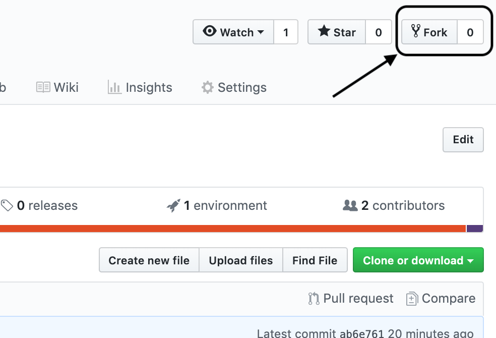
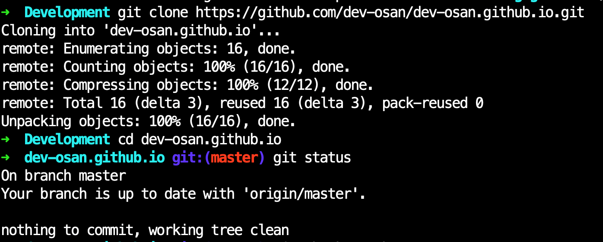

# Contributing

Please feel free to update this document. There's probably a bunch of ambiguous directions that I take for granted.

Feel free to ask any questions in the [Facebook group](https://www.facebook.com/groups/256151891980498) or when we meet up at the club.

## Create a Github account
[https://github.com/](https://github.com/)

## Install and get familiar with Git
Follow this guide to install Git [https://help.github.com/en/articles/set-up-git](https://help.github.com/en/articles/set-up-git). If you're feeling real motivated, that guide will pretty much walk you through everything I'm going to lay out here. Understanding Git is going to be really important. There are ways to work around it, but if you learn it, collaborating on code with others will be much easier. Other than the original website, here is a good starter resource [https://www.codecademy.com/learn/learn-git](https://www.codecademy.com/learn/learn-git)

## Fork the Repository (repo)
Click on the `Fork` button at the top right of the page. This will create a copy of the repository in your github account. The copy is linked to the original, so when you make a `pull request`, it knows where it's going.

## Clone down your new copy of the repository to your computer
Open your terminal or command prompt and navigate to the directory you want to store the code. This is just like navigating the folders on your computer, just that you're doing it from the terminal - none of that fancy graphical user interface (gui) anymore! You can view a list of files and folders by typing `ls` (mac) or `dir` (windows) and hitting Enter. You can go into another folder by using the change directory command `cd folderName` and hitting Enter. You can navigate up a folder by typing `cd ..` and hitting Enter. Once you are in the folder you want to create the project folder in, click the `clone or download` button (It's green, top right) and copy the URL that it shows. Once you do that, go back to your terminal and type `git clone https://github.com/userName/repoName` Make sure to swap out the URL for the one you copied!

Success looks like this:

## Let's make sure we're watching the original repository
If someone changes the original repo, you want to make sure you can get those changes to, so in the terminal, type `git remote add upstream https://github.com/dev-osan/dev-osan.github.io.git` and hit Enter. You can run `git fetch upstream` to pull down any new changes to the original repo that others may have done. Make sure to do this each time you're about to tackle an issue or make changes to ensure you're working in the most up to date version.

## Make changes!
Open your code editor, I use [Visual Studio Code](https://code.visualstudio.com/), and open the folder that you just created. Once that's done, you should be able to see the files from the project, hopefully with some nice colors (syntax highlighting). Edit the code and save your files!

## Commit the changes you've made.
Git works by _staging_ the files you want to commit, and then you have to _commit_ them while providing a message. This is like a big save to the overall codebase. In your terminal, write `git add .` and hit Enter. This adds all of the changed files to the staging area. Then when you're ready, type in `git commit -m 'I promise to write a quick summary of my changes here using future tense language.'` and hit Enter.

## Now let's push the code back up to github!
After committing all of your changes (you can make multiple commits), it's time to push up the code. Type `git push` and hit Enter. At this point, if you've never done this before you may need to type in your github login credentials. You can also `git push` as many times as you like before you go to the next step.

## The Pull Request
At this point, you're ready to make a pull request, which is like saying _"Hey original repo, will you pull my changes into yours, please?"_ On your repo page, click `New Pull Request` and follow the instructions through submitting the pull request. We'll review it, merge it, or give you feedback!

## Rinse & Repeat
_self explanatory_

Here are some links that may be helpful for this process:  
[Creating a pull request from a fork](https://help.github.com/en/articles/creating-a-pull-request-from-a-fork)  
[Contributing](https://github.com/MarcDiethelm/contributing/blob/master/README.md)  
[First Contributions](https://github.com/firstcontributions/first-contributions)  
[GitHub Help and Documentation](https://help.github.com/en)  
[How to Keep a Downstream git Repository Current with Upstream Repository Changes](https://medium.com/sweetmeat/how-to-keep-a-downstream-git-repository-current-with-upstream-repository-changes-10b76fad6d97)  
[Your first open source contribution: a step-by-step technical guide](https://medium.com/@jenweber/your-first-open-source-contribution-a-step-by-step-technical-guide-d3aca55cc5a6)  
